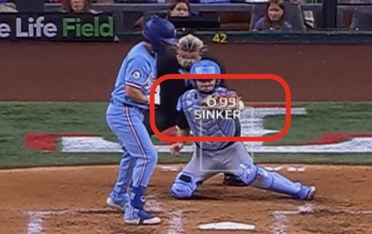

**TLDR:** I used an LLM to turn a bit of lazy channel-surfing into structured data showing which MLB broadcasts make it easiest to learn pitch types. Sometimes the most valuable thing a data scientist can do isn’t building fancy models, but just collecting the right data in the first place.

I've been a baseball fan since kindergarten, and I've watched a lot of games, but I'm still not great at recognizing pitch types. Is the pitch a four-seam fastball or a sinker/two-seam fastball? Is it a slider or a cutter? If a broadcast shows the pitch type with every pitch, then I can watch games, pay attention to what each pitch looks like and what type the broadcast says it is, and train the pattern-recognition part of my brain.

[MLB.TV](https://www.mlb.com/live-stream-games/) makes it easy to watch any game and any broadcast... but which broadcasts show information to make it easiest to learn pitches? Unfortunately, as of June 2025, not every team provides pitch type data. Further, with one welcome exception, the broadcasts that do show the pitch type display the type in the corner or bottom of the screen, and so learning requires flicking one's eyes back and forth between the plate/pitch and the pitch type. Ideally, the broadcast would show the pitch type directly with the pitch. **Thank you, the Chicago White Sox, for being the only broadcast that does this.**

(The pitch type data comes from MLB's [Statcast system](https://en.wikipedia.org/wiki/Statcast), which is itself pretty amazing, what with fancy cameras and AI.)

So, which games and broadcasts should I watch? For each of the 30 MLB team broadcasts, I wanted to know whether the broadcast included pitch type data and, if so, how the pitch type was displayed. I could have gotten out my laptop, created a text or Excel file, and then methodically viewed each broadcast and typed in the data. But, actually, I probably wouldn't have bothered, since working on a laptop while watching baseball takes away from the game.

Where do LLMs come in? Among many benefits, LLMs make it easy to collect data. Instead of giving up, I pulled out my phone, started a new chat in the ChatGPT app, and used text-to-speech to say I was going to collect data. Then I flipped through the different games and verbally described what I saw. I didn't follow any particular format or structure - I just talked to the app. When I'd done this for most of the broadcasts, ChatGPT confirmed for me the teams I hadn't yet covered. When I'd watched every broadcast, I asked for a Markdown table with all of the data. ChatGPT happily complied - the full list is below - and, attempting to be helpful to the last, also volunteered to give me a .csv file I could use in further work.

(Oh yeah, I'd noticed that a lot of teams had broadcasts that looked similar, and that at least some of these had FanDuel branding, so I asked ChatGPT to add a column with the name of the network. A few seconds later, I had an updated table, without any effort on my part.)

Amazing.

Speaking generally about data science best practices, while fancy algorithms get attention, sometimes the grunt work of gathering the right data is what matters most. It's exciting that LLMs can make this part of the job easier.

And LLMs also quickly generate structured data, which is often easier for people to understand and for computers to use. Think about paragraphs of text compared to something like a table... the table is often easier to parse, makes it easier to compare values, etc. Most traditional ML algorithms need rows of data, with the same fields for each observation; it's easy to generate charts and visuals from tabular data; and so on.

For background info, and what was to me the inspiration for the above, I thank Simon Willison. He's written about how LLMs make generating structured data easy, his [LLM command line tool has built-in functionality for generating structured data](https://simonwillison.net/2025/Feb/28/llm-schemas/), and he's delivered conference talks with cool examples, like [extracting FEMA disaster declarations from a PDF](https://github.com/simonw/nicar-2025-scraping/?tab=readme-ov-file#3-structured-data-extraction-using-llm).

I also enjoyed a great book about pitch types - and about Felix Hernandez's beautiful 2012 perfect game: Terry McDermott's [Off Speed: Baseball, Pitching, and the Art of Deception](https://www.amazon.com/Off-Speed-Baseball-Pitching-Deception-ebook/dp/B00NDTQQ58/).

# Pitch type information in MLB broadcasts

- 'Overlay info': What's shown overlaid in the center of the screen, near home plate and the pitch
- 'Corner info' and 'Bottom info': What's shown in the corner of the screen or along the bottom of the screen
- Data gathered mid-June 2025. I spot-checked some but didn't exhaustively validate each row.

| Team                  | Overlay info                 | Corner info              | Bottom info              | Network                          |
| --------------------- | ---------------------------- | ------------------------ | ------------------------ | -------------------------------- |
| Arizona Diamondbacks  | Pitch speed                  | Pitch speed              | —                        | MLB Local Media / DBACKS.TV      |
| Atlanta Braves        | Pitch speed                  | —                        | Pitch speed & pitch type | FanDuel Sports Network           |
| Baltimore Orioles     | Pitch speed                  | Pitch speed & pitch type | —                        | MASN                             |
| Boston Red Sox        | Pitch speed                  | Pitch speed & pitch type | —                        | NESN                             |
| Chicago Cubs          | Pitch speed                  | Pitch speed              | —                        | Marquee Sports Network           |
| Chicago White Sox     | **Pitch speed & pitch type** | —                        | —                        | NBC Sports Chicago               |
| Cincinnati Reds       | Pitch speed                  | —                        | Pitch speed & pitch type | FanDuel Sports Network Ohio      |
| Cleveland Guardians   | Pitch speed                  | Pitch speed              | —                        | MLB Local Media                  |
| Colorado Rockies      | Pitch speed                  | Pitch speed              | —                        | MLB Local Media                  |
| Detroit Tigers        | Pitch speed                  | —                        | Pitch speed & pitch type | FanDuel Sports Network           |
| Houston Astros        | Pitch speed                  | Pitch type               | —                        | Space City Home Network          |
| Kansas City Royals    | Pitch speed                  | —                        | Pitch speed & pitch type | FanDuel Sports Network           |
| Los Angeles Angels    | Pitch speed                  | —                        | Pitch speed & pitch type | FanDuel Sports Network           |
| Los Angeles Dodgers   | Pitch speed                  | —                        | —                        | Spectrum SportsNet LA            |
| Miami Marlins         | Pitch speed                  | —                        | Pitch speed & pitch type | FanDuel Sports Network           |
| Milwaukee Brewers     | Pitch speed                  | —                        | Pitch speed & pitch type | FanDuel Sports Network Wisconsin |
| Minnesota Twins       | Pitch speed                  | Pitch speed              | —                        | MLB Local Media                  |
| New York Mets         | —                            | Pitch speed              | —                        | SportsNet New York (SNY)         |
| New York Yankees      | Pitch speed                  | Pitch speed              | —                        | YES Network                      |
| Oakland Athletics     | Pitch speed                  | Pitch speed & pitch type | —                        | NBC Sports California            |
| Philadelphia Phillies | Pitch speed                  | Pitch speed & pitch type | —                        | NBC Sports Philadelphia          |
| Pittsburgh Pirates    | Pitch speed                  | Pitch speed              | —                        | SportsNet Pittsburgh             |
| San Diego Padres      | Pitch speed                  | Pitch speed              | —                        | MLB Local Media                  |
| San Francisco Giants  | Pitch speed                  | Pitch speed & pitch type | —                        | NBC Sports Bay Area              |
| Seattle Mariners      | Pitch speed                  | Pitch speed              | —                        | Root Sports Northwest            |
| St. Louis Cardinals   | Pitch speed                  | —                        | Pitch speed & pitch type | FanDuel Sports Network           |
| Tampa Bay Rays        | Pitch speed                  | —                        | Pitch speed & pitch type | FanDuel Sports Network           |
| Texas Rangers         | Pitch speed                  | Pitch speed & pitch type | —                        | Rangers Sports Network           |
| Toronto Blue Jays     | Pitch speed                  | —                        | —                        | Sportsnet                        |
| Washington Nationals  | Pitch speed                  | Pitch speed & pitch type | —                        | MASN                             |

Lastly, I could have taken screen shots of each broadcast and asked an LLM to extract the information on its own. Not each broadcast screen shot definitively says what team and broadcast it is, so I'd have to add that information myself. Another experiment for another day. :-).
