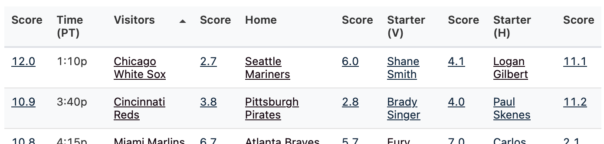

If you like baseball, and not just your home team, how do you choose from the as many as 15 games that happen most days? You could always look at a list of pitchers and teams and try to remember off hand who's doing well and is fun to watch, and click through to read previews occasionally, but that takes a good amount of time.

Or, just hit the [Latest MLBW](https://andrewenfield.com/latest-mlbw/) blog post and start at the top - the games are ranked by 'watchability', based on a set of stats outlined below.

Carson Cistulli [had this idea](https://blogs.fangraphs.com/introducing-team-nerd/) when he was at FanGraphs, and it's a great one. I think he made his posts manually. I've written code that every morning automatically pulls the stats, calculates "NERD" scores for the starting pitchers, the teams, and the game overall, uses [Claude](https://www.anthropic.com/claude) to generate a text summary of each game, and then makes and publishes a new blog post. The commentary isn't as good as when he wrote them, but the info is useful enough to me that I look at the post pretty much every day.

The table starts ordered by best overall score, as shown on the left. You can click each overall score or scroll down to get detailed stats and a text summary for each game; re-order the list by time, team, or pitcher scores; and can click the team and pitcher name to visit FanGraphs for more info.

What makes for a high score? Things that are fun to watch, or not. I've followed the general approach that Cistulli formed over multiple years, in some cases updating to stats that are more recent and that I can retrieve automatically. What I have is a first cut - I haven't done a super-detailed analysis or review of every possible candidate, and I'll likely tweak if/when I spend more time.

The pitcher score uses these stats:

- xFIP-:
- Swinging strike rate:
- Strike rate:
- Fastball velocity:
- Age:
- Pace:
- "Luck":
- Knuckleball rate:

The team score uses these stats:

- Batting runs:
- Barrel rate:
- Baserunning runs:
- Fielding runs:
- Payroll:
- Age:
- Luck:

For most of the stats, I calculate the [z-score](https://en.wikipedia.org/wiki/Standard_score) - so a preliminary score that's average is zero, a score of one is one standard deviation above the mean, and so on. Then I (sometimes) multiply that z-score by a value to bump up or down based on importance - for example, I multiple pitcher xFIP- by two. I cap some components, like age, payroll, and luck, so they're always between zero and a given value, like two. You can see the details of the calculation for each team and pitcher in the detailed tables further down the page. The overall game score itself is the mean of the team and pitcher scores.

There are a lot of things that would be great to add - these are all part of my enjoyment of watching or listening to a game:

- How good are the broadcasters? RIP [Vin Scully](https://www.mlb.com/news/vin-scully-greatest-calls), who would get an automatic plus-a-lot for every game.
- Does the park or broadcast itself make the game more fun to watch? Can I [see the pitch type](https://andrewenfield.com/blog/2025/06/29/using-llms-to-collect-mlb-broadcast-data-or-which-mlb-broadcasts-show-pitch-types/) where the ball crosses the plate?
- How good is the bullpen? The team stats are currently about offense.
- Are there other stats that correlate to things that are fun to watch? There are a lot of new stats that weren't a thing when Cistulli created the first scores.
- Is the game relevant for the post-season? (Although empirically playoff-involved teams tend to have better team scores and better pitchers, so some of this comes through already.)

Finally, [Claude Code](https://docs.anthropic.com/en/docs/claude-code/overview) is amazing. I could have written the code myself, but I've wanted this since Cistulli stopped posting ~10 years ago, and I've never made the time until I wanted a project to try with agentic coding. Claude Code blew my expectations out of the water. I'll write more about this at some point.
